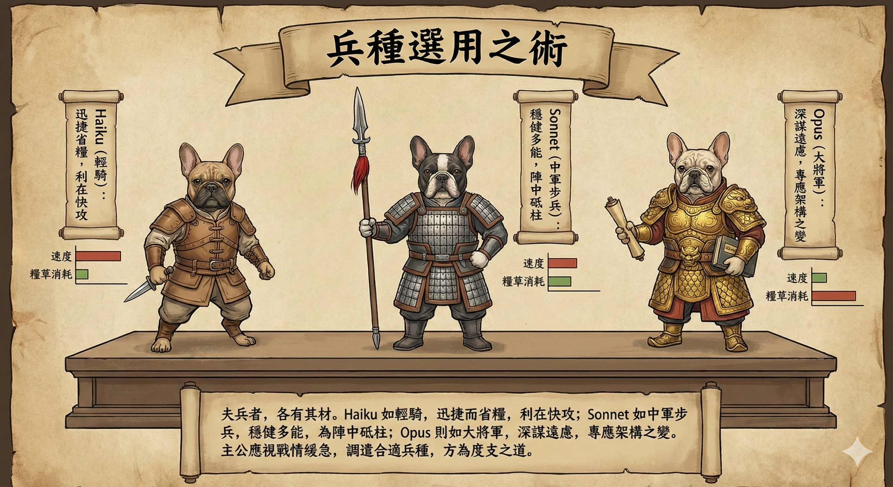
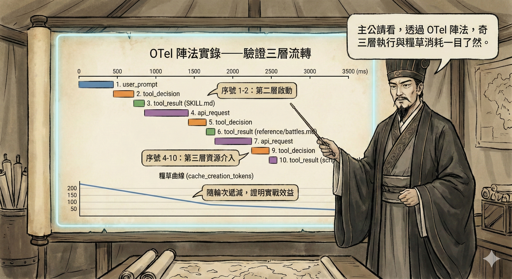

# 臥龍神算監控秘錄：斥候情報與大帳沙盤之術

> 稟告主公：此乃司馬懿進呈之兵書，詳解如何以 OpenTelemetry 陣法，令臥龍神算之一舉一動盡在掌握，知糧草消耗、察兵器效能、辨戰報異常，使主公運籌帷幄於大帳之中。

---

## 謀略目錄

1. [為何需要斥候情報？](#為何需要斥候情報)
2. [連環陣法總覽](#連環陣法總覽)
3. [軍情二分：數報與戰報](#軍情二分數報與戰報)
4. [烽火台速建之法](#烽火台速建之法)
5. [兵書詳解：settings.json 深度解析](#兵書詳解settingsjson-深度解析)
6. [五軍聯動：監控堆疊元件解析](#五軍聯動監控堆疊元件解析)
7. [大帳沙盤導覽](#大帳沙盤導覽)
8. [觀圖識機：看到什麼、代表什麼、能做什麼](#觀圖識機看到什麼代表什麼能做什麼)
9. [軍情數報完整冊（所有 Metrics）](#軍情數報完整冊所有-metrics)
10. [戰報文書總錄（所有 Events）](#戰報文書總錄所有-events)
11. [奇兵五策：進階應用場景](#奇兵五策進階應用場景)
12. [度支算糧：ROI 衡量與成本分析](#度支算糧roi-衡量與成本分析)
13. [諸侯聯盟：多人團隊監控](#諸侯聯盟多人團隊監控)
14. [陣前排難：常見問題排除](#陣前排難常見問題排除)
15. [密情守則：安全性與隱私考量](#密情守則安全性與隱私考量)

<!-- truncate -->
---

## 為何需要斥候情報？

**司馬懿稟告主公：**

臥龍神算（Claude Code）乃當世利器，然若無斥候回報，主公便如蒙眼行軍——兵器耗損幾何、糧草消費幾許、哪路斥候出了差錯，一概不知。臣以為，此乃兵家大忌。

無情報之弊，有四：

- **軍費不明**：不知每日每週糧草消耗幾何，哪場戰役尤為耗費
- **用兵不察**：哪件兵器最常被調遣？哪件兵器行動最遲緩？
- **功績難量**：無法向諸將或主公展示神算工具帶來的實際戰果
- **敗仗難溯**：兵器偶有失靈卻不知是哪件、發生在何種陣仗之中

透過 OpenTelemetry 陣法整合，主公可得以下情報：

✅ **即時掌握等效軍費消耗**（精確到每支兵馬、每五分鐘的耗糧節奏）
✅ **分析糧草使用效率**（糧倉補給命中率、輸入糧草 vs 產出糧草之比）
✅ **掌握兵器出征行為**（哪件兵器最常出動、哪件行進最遲）
✅ **追查折戟與傳令失利**（逐筆查閱失靈兵器、驛站告急、虎符拒發記錄）
✅ **多路諸侯比較**（按使用者、團隊、部門分層分析兵力消耗）

---

## 連環陣法總覽

**司馬懿展開沙盤，向諸將說明：**


```
┌─────────────────────────────────────────────────────────────────┐
│  主公之大本營（開發機器）                                           │
│                                                                   │
│  臥龍神算 CLI                                                      │
│  ├── CLAUDE_CODE_ENABLE_TELEMETRY=1  ← 命令斥候出發的虎符          │
│  ├── OTEL_METRICS_EXPORTER=otlp     → 軍情數報                    │
│  └── OTEL_LOGS_EXPORTER=otlp        → 戰報文書                    │
│           │                                                       │
│           │ OTLP gRPC :4317 / HTTP :4318（驛道）                   │
│           ▼                                                       │
│  ┌────────────────────────────────┐                              │
│  │  情報中樞（OTel Collector）      │  ← 傳令中軍，統一收發          │
│  │  (otel/opentelemetry-          │                              │
│  │   collector-contrib:0.145.0)   │                              │
│  │                                │                              │
│  │  接收：OTLP（gRPC/HTTP 兩路）   │                              │
│  │  處理：限制糧草、批次傳遞        │                              │
│  │  分發：                        │                              │
│  │    ├── 糧草台帳 (:8889)         │                              │
│  │    └── 戰報文書庫 (:3100/otlp)  │                              │
│  └────────────────────────────────┘                              │
│           │                    │                                  │
│           ▼                    ▼                                  │
│  ┌──────────────┐    ┌──────────────┐                           │
│  │  糧草台帳     │    │  戰報文書庫   │  ← 情報儲存               │
│  │ (Prometheus) │    │  (Loki 3.6)  │                           │
│  │  v2.55.1     │    │  (戰況存錄)   │                           │
│  │  (:9090)     │    │  (:3100)     │                           │
│  └──────────────┘    └──────────────┘                           │
│           │                    │                                  │
│           └─────────┬──────────┘                                │
│                     ▼                                             │
│              ┌────────────┐                                      │
│              │  大帳沙盤   │  ← 統帥覽圖之所（Grafana）             │
│              │  12.3.3    │                                      │
│              │  (:3000)   │                                      │
│              └────────────┘                                      │
└─────────────────────────────────────────────────────────────────┘
```

### 情報傳遞路徑

| 情報種類 | 傳遞路徑 | 儲存之所 | 用途 |
|---------|---------|---------|------|
| **軍情數報（Metrics）** | OTLP → 情報中樞 → 糧草台帳 | Prometheus TSDB | 時序趨勢、消耗分析、告警 |
| **戰報文書（Logs/Events）** | OTLP → 情報中樞 → 戰報文書庫 | Loki chunks | 詳細戰況記錄、折戟追溯 |

---

## 軍情二分：數報與戰報

**司馬懿言：** 情報有二類，各有其用，主公需知其別。

### 軍情數報（Metrics）
- **性質**：累積計數器，記錄糧草消耗總量
- **特性**：適合趨勢分析、消耗速率計算
- **存於**：糧草台帳（Prometheus）
- **回報頻率**：每 60 秒一次（可用 `OTEL_METRIC_EXPORT_INTERVAL` 加快）

### 戰報文書（Events/Logs）
- **性質**：結構化戰況記錄，含豐富上下文
- **特性**：包含具體兵器名稱、出征時長、折戟原因
- **存於**：戰報文書庫（Loki）
- **回報頻率**：每 5 秒一次（可用 `OTEL_LOGS_EXPORT_INTERVAL` 調整）

---

## 烽火台速建之法

*此節由諸葛亮主講。孔明搖動羽扇，微笑道：*

**孔明言：** 仲達所言陣法雖精妙，然主公若欲速見成效，可按亮之三法，依序而行。

### 第一法：臨陣點火（單次試用）

```bash
export CLAUDE_CODE_ENABLE_TELEMETRY=1
export OTEL_METRICS_EXPORTER=otlp
export OTEL_LOGS_EXPORTER=otlp
export OTEL_EXPORTER_OTLP_PROTOCOL=grpc
export OTEL_EXPORTER_OTLP_ENDPOINT=http://localhost:4317
export OTEL_SERVICE_NAME=claude-code

claude
```

### 第二法：軍令刻入兵書（永久設定，亮力薦此法）

編輯 `~/.claude/settings.json`（主公的兵書）：

```json
{
  "env": {
    "CLAUDE_CODE_ENABLE_TELEMETRY": "1",
    "OTEL_EXPORTER_OTLP_ENDPOINT": "http://localhost:4317",
    "OTEL_EXPORTER_OTLP_PROTOCOL": "grpc",
    "OTEL_SERVICE_NAME": "claude-code",
    "OTEL_METRICS_EXPORTER": "otlp",
    "OTEL_LOGS_EXPORTER": "otlp"
  }
}
```

### 第三法：加快斥候回報（偵錯模式）

```bash
export CLAUDE_CODE_ENABLE_TELEMETRY=1
export OTEL_METRICS_EXPORTER=console,otlp
export OTEL_LOGS_EXPORTER=console,otlp
export OTEL_METRIC_EXPORT_INTERVAL=5000   # 5秒（預設60秒）
export OTEL_LOGS_EXPORT_INTERVAL=1000     # 1秒（預設5秒）
```

### 連環陣法開陣

```bash
cd monitoring
docker compose up -d

# 確認五軍就位
docker compose ps

# 探查各軍健康
curl http://localhost:13133          # 情報中樞
curl http://localhost:3100/ready     # 戰報文書庫
curl -s http://localhost:3000/api/health | jq .  # 大帳沙盤
```

*司馬懿補充：* **主公需防一事**——連環陣法啟動後，約需等候 60 秒方能在大帳見到第一批軍情數報。此乃正常等候，非陣法有誤。

---

## 兵書詳解：settings.json 深度解析

**司馬懿接回主講：**

### 本軍兵書解讀

```json
{
  "env": {
    "CLAUDE_CODE_MAX_OUTPUT_TOKENS": "32000",     // 神算一次最多輸出之文字量
    "MAX_THINKING_TOKENS": "8000",                 // 神算思謀之最大用度
    "CLAUDE_CODE_EXPERIMENTAL_AGENT_TEAMS": "1",   // 啟用多路子軍同時出征
    "CLAUDE_CODE_ENABLE_TELEMETRY": "1",           // 啟用斥候情報（最關鍵之令）
    "OTEL_EXPORTER_OTLP_ENDPOINT": "http://localhost:4317",  // 情報中樞位址
    "OTEL_EXPORTER_OTLP_PROTOCOL": "grpc",         // 驛道傳令協議
    "OTEL_SERVICE_NAME": "claude-code",            // 本軍番號（戰報文書庫之識別標籤）
    "OTEL_METRICS_EXPORTER": "otlp",               // 軍情數報之傳送器
    "OTEL_LOGS_EXPORTER": "otlp"                   // 戰報文書之傳送器
  }
}
```

### 所有軍令旗號完整參考

#### 核心旗號

| 旗號名稱 | 預設 | 說明 |
|---------|------|------|
| `CLAUDE_CODE_ENABLE_TELEMETRY` | 未升（停用） | 必須升旗設為 `1`，斥候方能出發 |
| `OTEL_METRICS_EXPORTER` | 未設 | `otlp`、`prometheus`、`console`，可逗號並列多路 |
| `OTEL_LOGS_EXPORTER` | 未設 | `otlp`、`console` |
| `OTEL_EXPORTER_OTLP_PROTOCOL` | — | `grpc`、`http/protobuf`、`http/json` |
| `OTEL_EXPORTER_OTLP_ENDPOINT` | — | 情報中樞的驛道位址 |
| `OTEL_SERVICE_NAME` | `claude-code` | 本軍番號，作為戰報文書庫之 stream label |

#### 行軍調速旗號

| 旗號名稱 | 預設 | 說明 |
|---------|------|------|
| `OTEL_METRIC_EXPORT_INTERVAL` | `60000` ms | 軍情數報回傳間隔（毫秒） |
| `OTEL_LOGS_EXPORT_INTERVAL` | `5000` ms | 戰報文書回傳間隔（毫秒） |
| `OTEL_METRICS_TEMPORALITY_PREFERENCE` | `delta` | 若糧草台帳需要累積值，改為 `cumulative` |

#### 輜重管制旗號（高基數問題）

| 旗號名稱 | 預設 | 說明 |
|---------|------|------|
| `OTEL_METRICS_INCLUDE_SESSION_ID` | `true` | 數報中是否附記本場戰役番號 |
| `OTEL_METRICS_INCLUDE_VERSION` | `false` | 是否附記神算版本代數 |
| `OTEL_METRICS_INCLUDE_ACCOUNT_UUID` | `true` | 是否附記將領識別號 |

> ⚠️ **仲達提醒**：每場戰役（session）均有獨一番號，若台帳時序過多，可令 `OTEL_METRICS_INCLUDE_SESSION_ID=false`，以減輕糧草台帳之負擔。

#### 密情管制旗號

| 旗號名稱 | 預設 | 說明 |
|---------|------|------|
| `OTEL_LOG_USER_PROMPTS` | 未升（停用） | 設為 `1` 才將主公原話錄入戰報 |
| `OTEL_LOG_TOOL_DETAILS` | 未升（停用） | 設為 `1` 才記錄 MCP 軍需官名稱與奇術名目 |

---

## 五軍聯動：監控堆疊元件解析

**司馬懿正色道：**

臣為主公佈下五軍聯動之陣，缺一不可，各司其職。

### 第一軍：情報中樞（OTel Collector）

**兵書位址**：`monitoring/otelcol/config.yaml`

情報中樞乃整座連環陣法之樞紐，職責三分：
1. **接收斥候回報**：同時接收 gRPC（:4317）與 HTTP（:4318）兩路情報
2. **整理情報**：
   - `memory_limiter`：防止情報堆積壓垮中樞（限制 512MiB）
   - `batch`：批次整理，每 5 秒 / 1024 筆集中傳送
3. **分發情報**：
   - 軍情數報 → 糧草台帳（:8889 供台帳定期抄錄）
   - 戰報文書 → 戰報文書庫（HTTP OTLP）

情報中樞亦自我回報健康狀況（`:8888`），可透過糧草台帳直接查詢（`http://localhost:9090`）確認收發量。

### 第二軍：糧草台帳（Prometheus）

**兵書位址**：`monitoring/prometheus/prometheus.yml`

```yaml
scrape_configs:
  - job_name: "claude-code"
    scrape_interval: 15s
    static_configs:
      - targets: ["otelcol:8889"]
```

糧草台帳每 15 秒從情報中樞抄錄一次軍情數報，存入時序冊（TSDB）。

**存糧期限**：預設 15 天。如需延長，於 `docker-compose.yml` 加入：
```yaml
command:
  - "--storage.tsdb.retention.time=90d"
```

### 第三軍：戰報文書庫（Loki）

**兵書位址**：`monitoring/loki/loki-config.yaml`

戰報文書庫採用 TSDB schema v13（最新一代歸檔法），並開啟結構化密令支援（`allow_structured_metadata: true`），此乃接收 OTLP 戰報之必要設定。

**存檔期限**：30 天（`retention_period: 720h`）

### 第四軍：大帳沙盤（Grafana）

**版本**：12.3.3
**大帳位址**：`http://localhost:3000`（通關密語：admin / admin）

戰情圖透過自動佈陣（provisioning）載入，並設為大帳首頁：
```yaml
GF_DASHBOARDS_DEFAULT_HOME_DASHBOARD_PATH=/var/lib/grafana/dashboards/claude-code.json
```

---

## 大帳沙盤導覽

**司馬懿引諸將至大帳，指點沙盤：**


### 一覽台：戰役總覽（Session Overview）


| 旗標 | PromQL 軍令 | 說明 |
|------|-----------|------|
| 戰役總數（Total Sessions） | `count(count by (session_id)(claude_code_active_time_seconds_total))` | 共出征幾場戰役 |
| 軍費消耗（Total Cost） | `sum(increase(claude_code_cost_usage_USD_total[$__range]))` | 時間範圍內等效軍費 |
| 糧草總量（Total Tokens） | `sum(increase(claude_code_token_usage_tokens_total[$__range]))` | 糧草總消耗 |
| 出征時長（Active Time） | `sum(increase(claude_code_active_time_seconds_total[$__range])) / 3600` | 實際出征小時數 |

### 糧草軍費圖（Cost & Token Usage）

- **各路兵馬軍費速率**（Cost Rate by Model）：各兵種軍費消耗速率，識別哪路兵馬最貴
- **糧草類型速率**（Token Rate by Type）：輸入/輸出/糧倉取糧/糧倉存糧之速率趨勢
- **每五刻軍費**（Cost per 5 Minutes）：每五分鐘之軍費消耗（條形圖，按兵種分色）— 清楚顯示何時有密集出征，軍令為 `sum by (model)(increase(claude_code_cost_usage_USD_total[5m]))`
- **糧草類型分佈**（Token Distribution，圓餅圖）：時間範圍內各類型糧草占比
- **各路兵馬軍費占比**（Cost by Model，圓餅圖）：各兵種累積軍費占比
- **糧倉補給效率**（Cache Hit Rate）：`取糧 / 總糧草 × 100%`，越高表示糧倉調撥越順暢

> 💡 **仲達觀察**：糧倉補給效率乃衡量出征前軍令旗號是否穩定之要指。若主公每番出征皆沿用相同旗號，糧倉直接調撥，無需重新清點，軍費節省可觀。
>
> ⚠️ **仲達提醒**：此軍費數字為「等效 API 費用」而非主公每月繳納之固定月費。Pro / Max 方案按月收費，此數字僅供消耗趨勢參考，無法對應 Settings 中之配額使用百分比。


### 兵器排行榜（Top 10 Tools）


使用戰報文書庫 LogQL 軍令查詢（`tool_result` 戰報），資料來自結構化密令，直接 `unwrap` 取值。

| 旗標 | 查詢邏輯 | 說明 |
|------|---------|------|
| **出動次數排行** | `topk(10, count_over_time(...) by tool_name)` | 哪件兵器被調遣最頻繁 |
| **平均出征時長** | `topk(10, avg_over_time(unwrap duration_ms) by tool_name)` | 哪件兵器行動最遲，找出效能瓶頸 |

> 折戟詳情請見下方「戰報文書 → 兵器折戟記錄」，提供比排行榜更完整之逐筆戰況。

### 戰報文書閱覽（Logs & Events）

| 戰報 | LogQL 軍令 | 說明 |
|------|-----------|------|
| 兵器折戟記錄（Tool Failures） | `{service_name="claude-code"} \| event_name="tool_result" \| success="false"` | 所有失靈的兵器呼叫 |
| 傳令出使記錄（API Requests） | `{service_name="claude-code"} \| event_name="api_request"` | 所有傳令兵出使詳情 |
| 兵器出征記錄（Tool Executions） | `{service_name="claude-code"} \| event_name="tool_result"` | 所有兵器出征完整記錄 |
| 虎符決策記錄（Permission Decisions） | `{service_name="claude-code"} \| event_name="tool_decision"` | 虎符授予/拒發記錄 |
| 主公軍令記錄（User Prompts） | `{service_name="claude-code"} \| event_name="user_prompt"` | 主公發令記錄 |

---

## 觀圖識機：看到什麼、代表什麼、能做什麼

**司馬懿向諸將道：** 觀圖非為賞玩，乃為臨陣決策。每處旗標背後，皆有可採取之行動。

### 一覽台 — 一眼掌握戰役總況

| 見到… | 代表… | 可下令… |
|-------|-------|--------|
| 軍費消耗偏高 | 此段時間等效軍費較重 | 對照「每五刻軍費圖」找出哪個時段爆量出征 |
| 糧草高但軍費低 | 糧倉補給效率高，輸入糧草被有效重用 | 保持現有旗號，勿頻繁收兵重開戰役 |
| 出征時長遠低於實際工時 | 神算大部分時間在等主公下令 | 此為正常；若出征時長異常高，代表有長時間指令在執行 |
| 修築工事 = 0 | 神算未實際修改任何工事 | 確認此段時間是否只在對話，而非令神算動手施工 |

### 糧草軍費圖 — 費用節奏與效率

| 見到… | 代表… | 可下令… |
|-------|-------|--------|
| 每五刻軍費出現明顯尖峰 | 那個時段有密集傳令出使（大型任務或多輪對話）| 評估該任務之軍費是否合算，或拆解為更小步驟 |
| 糧倉補給效率 < 20% | 軍令旗號每次重新清點，未能善用糧倉 | 檢查是否頻繁開新戰役或大幅改動旗號 |
| 糧倉補給效率 > 60% | 旗號穩定，糧倉大量直接調撥 | 此乃善用之道，繼續保持 |
| 各路兵馬軍費幾乎全是 Opus | 高費用兵種占比過重 | 評估哪些任務可改調 Sonnet 出征（一般修築、探查任務） |
| 輸出糧草遠大於輸入糧草 | 神算輸出極多，可能在進行大型生成任務 | 確認輸出是否皆有被利用，勿浪費糧草 |

### 兵器排行榜 — 兵器使用行為

| 見到… | 代表… | 可下令… |
|-------|-------|--------|
| 衝鋒奇兵（Bash）出動遠多於他器 | 大量指令衝鋒，可能在跑測試或建置 | 正常；若平均時長也高，考慮優化指令或加設逾時限制 |
| 探查細作（Read）次數極高 | 神算頻繁探查，可能在大型兵書庫中反覆搜尋 | 考慮提供更精確的典籍位址，減少大範圍探查 |
| 子軍統帥（Task）平均時長特別高 | 子軍任務耗時甚長 | 檢查是否有子軍卡陣或任務過於複雜 |
| 某兵器平均時長異常偏高 | 出征遲緩，可能有逾時或大量回報 | 至「兵器出征記錄」查閱該兵器之具體戰況 |


### 戰報文書 — 折戟追查第一入口

| 見到… | 代表… | 可下令… |
|-------|-------|--------|
| 兵器折戟記錄有條目 | 兵器出征失靈，有折戟原因 | 展開戰報查看 `error` 欄位，定位失靈原因 |
| 傳令出使中 `duration_ms` 偏高 | 傳令兵往返耗時，可能是兵種過載或驛道壅塞 | 查看 `speed` 欄位（fast/normal）與糧草消耗量 |
| 虎符決策有「拒發」記錄 | 主公或守衛拒絕了某件兵器出征 | 確認是否為預期中的攔截，或需調整授權設定 |
| 主公軍令中 `prompt_length` 甚大 | 主公下達了極長之軍令 | 長軍令消耗更多輸入糧草；考慮分段或精簡措辭 |

---

## 軍情數報完整冊（所有 Metrics）

**司馬懿取出台帳典籍，逐一說明：**

### 指標命名轉換規則

糧草台帳（Prometheus）中，指標名稱由 `.` 轉換為 `_`：

| OTel 原名 | Prometheus 台帳名稱 |
|-----------|-------------------|
| `claude_code.session.count` | `claude_code_session_count_total` |
| `claude_code.cost.usage` | `claude_code_cost_usage_USD_total` |
| `claude_code.token.usage` | `claude_code_token_usage_tokens_total` |
| `claude_code.lines_of_code.count` | `claude_code_lines_of_code_count_total` |
| `claude_code.code_edit_tool.decision` | `claude_code_code_edit_tool_decision_total` |
| `claude_code.active_time.total` | `claude_code_active_time_seconds_total` |
| `claude_code.commit.count` | `claude_code_commit_count_total` |
| `claude_code.pull_request.count` | `claude_code_pull_request_count_total` |

### 各指標可用維度（Labels）

```
claude_code_cost_usage_USD_total
  └── 維度：model（兵種）、session_id（戰役番號）、user_account_uuid（將領號）...

claude_code_token_usage_tokens_total
  └── 維度：type (input|output|cacheRead|cacheCreation)、model、session_id...

claude_code_lines_of_code_count_total
  └── 維度：type (added|removed)、session_id...

claude_code_code_edit_tool_decision_total
  └── 維度：tool_name (Edit|Write|NotebookEdit)、decision (accept|reject)、
              source (config|hook|user_permanent|user_temporary|user_abort|user_reject)、
              language (TypeScript|Python|...|unknown)

claude_code_active_time_seconds_total
  └── 維度：type (user|cli)、session_id...
```

### 常用台帳查詢範例

```promql
# 今日軍費消耗
sum(increase(claude_code_cost_usage_USD_total[24h]))

# 按兵種分組的軍費速率
sum by (model)(rate(claude_code_cost_usage_USD_total[$__rate_interval]))

# 糧倉補給效率（節省軍費的關鍵指標）
100 * sum(increase(claude_code_token_usage_tokens_total{type="cacheRead"}[24h]))
    / sum(increase(claude_code_token_usage_tokens_total[24h]))

# 工事淨新增行數
sum(increase(claude_code_lines_of_code_count_total{type="added"}[24h]))
- sum(increase(claude_code_lines_of_code_count_total{type="removed"}[24h]))

# TypeScript 工事的修築核准率
sum(rate(claude_code_code_edit_tool_decision_total{language="TypeScript",decision="accept"}[$__rate_interval]))
/ sum(rate(claude_code_code_edit_tool_decision_total{language="TypeScript"}[$__rate_interval]))

# 每場戰役的平均軍費
sum(increase(claude_code_cost_usage_USD_total[$__range]))
/ count(count by (session_id)(claude_code_active_time_seconds_total))
```

---

## 戰報文書總錄（所有 Events）

### 軍令追蹤：prompt.id 關聯之法

**司馬懿道：** 每次主公下令，神算可能出動多路人馬。透過 `prompt.id` 可追蹤一道軍令觸發的完整行軍鏈路：

```
主公軍令 (prompt.id: "abc-123")
  └── 傳令出使 (prompt.id: "abc-123")
  └── 傳令出使 (prompt.id: "abc-123")  ← 同一道令可能多次傳令
  └── 衝鋒奇兵出征 (prompt.id: "abc-123")
  └── 探查細作出征 (prompt.id: "abc-123")
  └── 修築工事出征 (prompt.id: "abc-123")
  └── 虎符決策 (prompt.id: "abc-123")
```



查詢特定軍令之完整行軍記錄：
```logql
{service_name="claude-code"} | json | prompt_id = "你的-prompt-id"
```

### 各類戰報詳細欄位

#### `user_prompt`（主公軍令）

```json
{
  "event.name": "user_prompt",
  "event.timestamp": "2025-01-15T10:30:00Z",
  "event.sequence": 1,
  "prompt_length": 256,
  "prompt": "<僅在 OTEL_LOG_USER_PROMPTS=1 時才錄入原話>"
}
```

#### `api_request`（傳令出使）

```json
{
  "event.name": "api_request",
  "model": "claude-sonnet-4-6",
  "cost_usd": 0.00145,
  "duration_ms": 3200,
  "input_tokens": 12500,
  "output_tokens": 850,
  "cache_read_tokens": 11000,
  "cache_creation_tokens": 1500,
  "speed": "normal"
}
```

#### `tool_result`（兵器出征結果）

```json
{
  "event.name": "tool_result",
  "tool_name": "Bash",
  "success": "true",
  "duration_ms": 450,
  "tool_result_size_bytes": 2048,
  "decision_type": "accept",
  "decision_source": "config",
  "tool_parameters": "{"bash_command":"npm test","timeout":120000}"
}
```

#### `tool_decision`（虎符授決）

```json
{
  "event.name": "tool_decision",
  "tool_name": "Edit",
  "decision": "accept",
  "source": "user_permanent"
}
```

#### `api_error`（傳令失利）

```json
{
  "event.name": "api_error",
  "model": "claude-sonnet-4-6",
  "error": "Rate limit exceeded",
  "status_code": "429",
  "duration_ms": 500,
  "attempt": 2,
  "speed": "normal"
}
```

---

## 奇兵五策：進階應用場景

**司馬懿獻上五策奇謀：**

### 第一策：識別最拖沓之兵器

```logql
# 找出平均出征時長最久的兵器
topk(10,
  sum by (tool_name)(
    sum_over_time(
      {service_name="claude-code"} | event_name=`tool_result` | json
      | unwrap duration_ms | __error__="" [24h]
    )
  ) /
  sum by (tool_name)(
    count_over_time(
      {service_name="claude-code"} | event_name=`tool_result` [24h]
    )
  )
)
```

### 第二策：察看衝鋒奇兵之動向

```logql
# 查看所有衝鋒指令（需 tool_parameters 中有 bash_command）
{service_name="claude-code"}
  | event_name=`tool_result`
  | tool_name=`Bash`
  | json
  | line_format "{{.tool_parameters}}"
```

### 第三策：衡量出征效率（每時辰產出）

```promql
# 每時辰新修工事行數
sum(rate(claude_code_lines_of_code_count_total{type="added"}[1h])) * 3600

# 每時辰插旗（commit）次數
sum(rate(claude_code_commit_count_total[1h])) * 3600
```

### 第四策：異常軍費告警（大帳預警）

在大帳沙盤中設定告警旗號：

```promql
# 當一個時辰軍費超過五金時觸發警報
sum(increase(claude_code_cost_usage_USD_total[1h])) > 5
```

### 第五策：兵種選用最佳化

```promql
# 各兵種「每單位糧草之軍費」效率比較
sum by (model)(rate(claude_code_cost_usage_USD_total[$__rate_interval]))
/
sum by (model)(rate(claude_code_token_usage_tokens_total[$__rate_interval]))
```

---

## 度支算糧：ROI 衡量與成本分析

**司馬懿掐指算道：**

### 戰力量化之道

| 指標 | 衡量方式 | PromQL 軍令 |
|------|---------|-----------|
| **工事產出速率** | 每時辰新修行數 | `rate(claude_code_lines_of_code_count_total{type="added"}[24h])` |
| **插旗頻率** | Commit / PR 頻率 | `rate(claude_code_commit_count_total[7d])` |
| **兵器效率** | 工事核准率 | `accept / (accept + reject)` |
| **糧倉節省** | 糧倉補給命中節省費用 | `cacheRead tokens × 輸入單價 × 0.9（折扣）` |

### 糧草管控四訣

1. **每日告警**：設定大帳預警，當單日軍費超出預算即鳴金示警
2. **兵種選用**：Opus 4.6 費用約為 Sonnet 4.6 之十五倍，確認是否調用了正確兵種
3. **糧倉優化**：軍令旗號越穩定，糧倉補給效率越高，可節省九成糧倉部分之費用
4. **戰役時長**：久戰不收兵，context 越積越大，軍費越高；適時鳴金收兵重整，可節省消耗

### 月度軍費戰報（PromQL）

```promql
# 本月總軍費
sum(increase(claude_code_cost_usage_USD_total[30d]))

# 本月 vs 上月軍費環比
sum(increase(claude_code_cost_usage_USD_total[30d]))
/ sum(increase(claude_code_cost_usage_USD_total[30d] offset 30d))
```

---

## 諸侯聯盟：多人團隊監控

**司馬懿謀劃多路諸侯協同之策：**

### 以旗號區別各路人馬

```bash
# 於各將領的兵書中設定所屬陣營
export OTEL_RESOURCE_ATTRIBUTES="department=engineering,team.id=platform,cost_center=eng-123"
```

### 按將領分組之軍費查詢

```promql
# 各將領之軍費分佈
sum by (user_account_uuid)(increase(claude_code_cost_usage_USD_total[7d]))

# 各將領糧草消耗排行（前十名）
topk(10,
  sum by (user_account_uuid)(
    increase(claude_code_token_usage_tokens_total[7d])
  )
)
```

### 主帥統一部署：管理員集中設定

於 `/etc/claude/settings.json`（主帥令冊）中統一部署：

```json
{
  "env": {
    "CLAUDE_CODE_ENABLE_TELEMETRY": "1",
    "OTEL_METRICS_EXPORTER": "otlp",
    "OTEL_LOGS_EXPORTER": "otlp",
    "OTEL_EXPORTER_OTLP_PROTOCOL": "grpc",
    "OTEL_EXPORTER_OTLP_ENDPOINT": "http://collector.company.com:4317",
    "OTEL_EXPORTER_OTLP_HEADERS": "Authorization=Bearer company-token"
  }
}
```

> 📝 主帥令冊之優先度高於各將領自設兵書，無法被覆蓋。

---

## 陣前排難：常見問題排除
司馬懿終末叮嚀：

主公，圖表雖美，然「觀圖」之後的「決策」才是勝負關鍵。臣已將這些陣法圖示融入秘錄之中，建議主公下一步可執行以下軍令：


**司馬懿沉聲道：** 主公需防以下陣前之亂，臣逐一列出破解之法。

### 亂象一：大帳沙盤無任何軍情數報

**診斷步驟**：

```bash
# 1. 確認情報中樞正在接收斥候回報
docker compose logs otelcol --tail=50

# 2. 確認糧草台帳之抄錄目標狀態
curl -s http://localhost:9090/api/v1/targets | jq '.data.activeTargets[] | {job: .labels.job, health: .health}'

# 3. 直接查閱情報中樞匯出之數報
curl -s http://localhost:8889/metrics | grep claude_code | head -20

# 4. 確認虎符旗號已升起
claude --version  # 並在啟動前 echo $CLAUDE_CODE_ENABLE_TELEMETRY
```

**常見原因**：
- `CLAUDE_CODE_ENABLE_TELEMETRY` 旗號未升或不在正確的營帳（shell）中
- 情報中樞驛道（4317）未開放
- 糧草台帳尚未完成首次抄錄（等候 >30 秒）

### 亂象二：戰報文書庫無任何戰報

```bash
# 1. 確認戰報文書庫已就緒
curl http://localhost:3100/ready

# 2. 查詢庫中是否有任何存檔
curl -G -s "http://localhost:3100/loki/api/v1/query" 
  --data-urlencode 'query={service_name="claude-code"}' 
  --data-urlencode 'limit=5' | jq .

# 3. 若無存檔，確認情報中樞之戰報管道
docker compose logs otelcol | grep -i "loki\|log"
```

**戰報分類過濾問題**：

若 `event_name` 存於戰報正文而非標籤，需改用：
```logql
# 原本（不可用）
{service_name="claude-code"} | event_name=`tool_result`

# 改為 JSON 解讀
{service_name="claude-code"} | json | event_name = "tool_result"
```

### 亂象三：情報中樞啟動告急

```bash
# 戰報文書庫啟動較慢，重整情報中樞
docker compose restart otelcol

# 查閱詳細告急原因
docker compose logs otelcol --follow
```

### 亂象四：戰報文書庫拒收結構化密令

確認 `loki/loki-config.yaml` 包含：
```yaml
limits_config:
  allow_structured_metadata: true
```

重整：
```bash
docker compose restart loki
```

### 亂象五：驛道衝突

預設佔用驛道：`3000, 3100, 4317, 4318, 8888, 8889, 9090, 13133`

若有衝突，修改 `docker-compose.yml` 之驛道映射：
```yaml
ports:
  - "14317:4317"  # 將外部驛道從 4317 改為 14317
```

並同步修改 `settings.json` 中之情報中樞位址。

---

## 密情守則：安全性與隱私考量

**司馬懿正色叮囑：** 情報雖重要，洩密亦是大患，主公需知以下密情守則。

### 預設隱私防護

臥龍神算之遙測，預設已做以下防護：

| 情報種類 | 預設處置 | 啟用方式 |
|---------|---------|---------|
| 主公原話完整內容 | **不錄入**，只記錄字數 | `OTEL_LOG_USER_PROMPTS=1` |
| 軍需官（MCP server）名稱 | **不錄入** | `OTEL_LOG_TOOL_DETAILS=1` |
| 奇術（Skill）名目 | **不錄入** | `OTEL_LOG_TOOL_DETAILS=1` |
| 原始工事內容（程式碼）| **永不錄入** | 無法啟用 |
| 衝鋒指令（含參數）| 錄入 `tool_parameters` | 可在後端過濾 |

### 潛在密情外洩之處

`tool_result` 戰報之 `tool_parameters` 欄位含衝鋒指令，可能含有：
- 密語（若直接寫在指令中）
- 金鑰令牌
- 典籍路徑（可能洩露大本營之目錄結構）

**建議**：在情報中樞中加入 `attributes` 處理器遮蔽敏感欄位：

```yaml
processors:
  attributes:
    actions:
      - key: tool_parameters
        action: delete  # 或使用 update + 遮罩
```

### 本地陣法 vs 遠端傳送

本連環陣法**完全在大本營運行**，無任何情報傳送至外部勢力。

若要傳送至雲端（如 Grafana Cloud、Datadog 等外藩），請確認：
1. 驛道加密（TLS/HTTPS）
2. 認證虎符（`OTEL_EXPORTER_OTLP_HEADERS` 設定 Bearer token）
3. 情報存留政策符合軍規

---

## 輜重存留期限

| 軍需所 | 預設存留 | 調整方式 |
|--------|---------|---------|
| 糧草台帳（Prometheus）| 15 天 | `--storage.tsdb.retention.time=90d` |
| 戰報文書庫（Loki）| 30 天（720h）| `loki-config.yaml: retention_period: 2160h` |
| 大帳沙盤（Grafana）| 永久（volume）| 刪除 `grafana_data` volume |

完整撤營重整：
```bash
cd monitoring
docker compose down -v  # 撤去所有輜重
docker compose up -d    # 重新開陣（清空所有存檔）
```



---

## 延伸兵書

- [Claude Code 監控文書](https://code.claude.com/docs/en/monitoring-usage)
- [Anthropic ROI 量化](https://github.com/anthropics/claude-code-monitoring-guide)
- [OpenTelemetry 規格](https://github.com/open-telemetry/opentelemetry-specification/blob/main/specification/protocol/exporter.md)
- [Prometheus PromQL 查詢教典](https://prometheus.io/docs/prometheus/latest/querying/basics/)
- [Loki LogQL 查詢文法](https://grafana.com/docs/loki/latest/query/)
- [Grafana Dashboard 程式碼](https://gist.github.com/tedmax100/06f0b9830939eea0ee3c3ec8f1d478bc)
---

*兵書版本：2026-02-19 ｜ 主述：司馬懿（仲達）、諸葛亮（孔明）｜ 由 `/sanguo-rewrite` 奇術生成*
