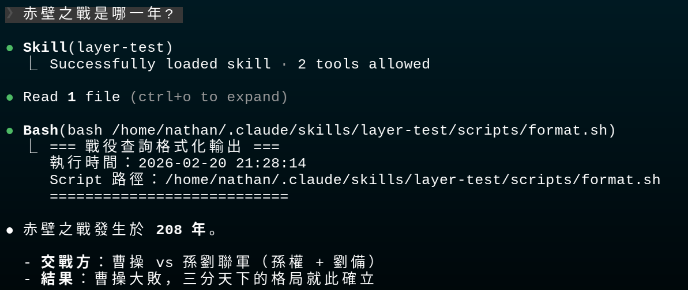
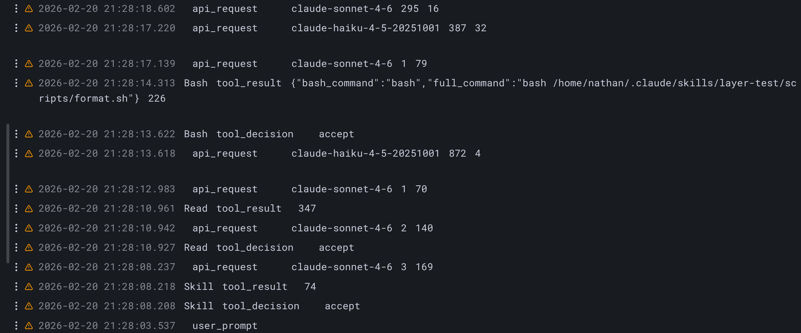

# 臥龍神算奇術完全兵書：從兵法原理到實戰，徹底搞懂奇術機制

> 接續上篇【OTel 陣法監控篇】，此卷深入解析奇術（Skills）機制——臥龍神算如何知曉有哪些兵器可用、糧草如何節省、奇術如何設計才不浪費、以及如何驗證奇術行為如你所謀。

---

## 稟告主公：為何需要奇術？

主公可曾遇過此種困境：每次要臥龍神算助你辦一件事，都得貼上一大段說明？

> 「請用我軍的插旗格式，格式如下：`feat(scope): 描述`，且...（以下三百字軍令）」

每次開新一場戰役便要重複貼上一遍。更慘的是，若你有三十份這樣的「工作說明書」，全部塞進軍令總諭，不但糧草爆炸，臥龍神算的注意力也會被稀釋——什麼都想做，反而什麼都做不精。

**奇術就是解決此問題的機制。**

其核心思想甚為簡單：**按需調兵，用多少拿多少。**

---

## 第一計：奇術如何運作？三層漸進揭露之術

此乃全篇兵書最重要之處。理解了此機制，後面所有的設計決策都會豁然開朗。

*此節由諸葛亮主講。孔明搖動羽扇，微笑道：*

**孔明言：** 主公請聽臣細細道來。


<!-- truncate -->

### 第一層：目錄情報（Metadata）

```
神算啟動時 → 只載入每個奇術的名稱與描述 → 佔用極少糧草
```

臥龍神算啟動時，**只**把所有奇術的名稱和描述載入軍令總諭。此乃圖書館的目錄卡，告訴神算「你的兵器庫裡有什麼」，但不把每本兵書的內容都塞進去。

**技術細節**：描述總共的糧草預算 = 戰場視野的 2%，最多 16,000 字元。若奇術太多超過預算，執行 `/context` 可以看到警告。

### 第二層：奇術兵書（Instructions）

```
將領說「幫我審查這份奏摺」
  → 神算發現這符合 "review-pr" 這個奇術
  → 透過後台指令讀取 SKILL.md 兵書
  → 詳細的部署步驟才進入神算的兵略
```

奇術被觸發時，神算才去讀 SKILL.md 兵書。在此之前，SKILL.md 的內容完全不佔用戰場視野。

### 第三層：運行時資源（Runtime Resources）

```
執行具體步驟時
  → 兵書輔冊（reference/*.md）：需要時才讀
  → 奇兵腳本（scripts/*.py）：直接執行，不讀進戰場視野
```

此處有個關鍵之點：**奇兵腳本只有輸出結果會耗用糧草，腳本本身的程式碼不會**。五百行的 Python 腳本，被執行後回傳一行結果，那也只花那一行結果的糧草。

```
┌────────────────────────────────────────────────────┐
│  奇術：漸進揭露三層陣法                              │
│                                                     │
│  第一層：目錄情報（神算啟動）                        │
│  ├── name: "review-pr"                              │
│  └── description: "..."    ← 只有這些進戰場視野      │
│                                                     │
│  第二層：奇術兵書（奇術被觸發）                      │
│  └── SKILL.md 全文         ← 此時才載入              │
│                                                     │
│  第三層：運行時資源（執行步驟中）                    │
│  ├── references/checklist.md ← 需要時才讀            │
│  └── scripts/validate.py    ← 只有輸出進戰場視野     │
└────────────────────────────────────────────────────┘
```

---

## 第二計：糧草如何節省？奇術與軍需官之本質差異

理解了三層陣法，我們來看奇術（Skills）和軍需官（MCP）的根本差異。

**司馬懿接回主講：**

*仲達撫著長袖，冷靜分析道：*


### 軍需官（MCP）的弊端

軍需官要讓神算知道「有哪些兵器可用」，必須在對陣開始時把**所有兵器的完整規格**一次性注入：名稱、詳細描述、參數規格、使用範例。

以 GitHub 軍需官為例，它有三十餘件兵器。假設每件兵器規格消耗五百糧草：

```
30 件兵器 × 500 糧草 = 15,000 糧草（光是「告知神算有哪些兵器」就花掉了）
```

若你連接四十個軍需官、三百件兵器，啟動成本可以高達數萬糧草。你還沒說任何事，神算就已經燒掉大量糧草了。

更麻煩的是，兵器太多會讓神算的注意力下降。根據 MCP Atlas 基準測試，即使最強的 Claude Opus 4.6 兵種，在四十個軍需官、三百件兵器的環境下，兵器調用準確率也只有 62%。

### 奇術的解法

| 比較維度   | 軍需官（MCP）                         | 奇術（Skills）               |
| ---------- | ------------------------------------- | ---------------------------- |
| 啟動時載入 | 全部兵器完整規格                      | 只載入名稱+描述（幾千糧草）  |
| 兵器選擇   | 神算從海量清單中挑                    | 漏斗式引導，逐層縮小         |
| 適合場景   | 連接外部服務（GitHub、Slack、資料庫） | 封裝固定行軍部署和本地知識庫 |
| 門檻       | 需要寫程式碼（MCP Server）            | 只需要寫兵書提示詞           |

💡 **孔明言**：兩者不互相取代，而是互補。軍需官專注「連接各方諸侯」，奇術專注「封裝行軍流程」。未來架構會是：

```
AI 謀士神算
  ├── 內建兵器（bash, read, write, edit）← 核心能力
  ├── 奇術層 ← 封裝 80% 的行軍流程
  └── 軍需官層 ← 少數場景需要遠端連線
```

---

## 第三計：你的第一個奇術——臨陣速建之法

*此節由諸葛亮主講。孔明搖動羽扇，微笑道：*

### 奇術駐紮何處？

| 位置 | 兵書位址                                   | 適用範圍 |
| ---- | ------------------------------------------ | -------- |
| 個人 | `~/.claude/skills/<skill-name>/SKILL.md` | 所有陣地 |
| 陣地 | `.claude/skills/<skill-name>/SKILL.md`   | 此陣地   |
| 軍團 | 由主帥令冊統一部署                         | 全軍組織 |

> **注意**：舊的 `.claude/commands/` 目錄依然有效，只是奇術目錄多了資料夾、輔助兵書等功能。

### 建立第一個奇術

```bash
mkdir -p ~/.claude/skills/commit-helper
```

建立 `~/.claude/skills/commit-helper/SKILL.md` 兵書：

```yaml
---
name: commit-helper
description: 根據 git diff 生成符合 Conventional Commits 規範的插旗訊息。當將領要插旗、寫插旗記錄、或詢問暫存變更時使用。
disable-model-invocation: true
---

根據 `git diff --staged` 的輸出，生成一條符合軍令規範格式的插旗訊息：

## 格式規則
- `feat(scope): 描述` — 新功能
- `fix(scope): 描述` — 修復亂象
- `docs(scope): 描述` — 兵書變更
- `refactor(scope): 描述` — 重整部署

## 行軍步驟
1. 執行 `git diff --staged` 查看變更
2. 分析變更類型和影響範圍
3. 生成一條簡潔的主訊息（50 字元以內）
4. 若有多項變更，加上條列說明

## 注意
- 不要自動執行 `git commit`，只輸出建議的訊息
- scope 用小寫，和陣地模組名稱一致
```

### 兩種召喚方式

**方式一：直接呼叫**

```
/commit-helper
```

**方式二：自然語言觸發**（描述符合時自動載入）

```
幫我整理一下這次的插旗訊息
```

---

## 第四計：兵書題記完整欄位解析

此為 `SKILL.md` 兵書開頭 `---` 之間可以設定的所有欄位：

```yaml
---
name: my-skill              # 奇術識別名稱（小寫英數和連字號，最多 64 字）
description: "..."          # 告訴神算何時使用（最多 1024 字，用第三人稱寫）
argument-hint: <奏摺號碼>   # 在 / 選單中顯示的參數提示
disable-model-invocation: true  # true = 只有將領能手動觸發，神算不會自動呼叫
user-invocable: false       # false = 從 / 選單隱藏，但神算可自動觸發
allowed-tools: Read, Grep   # 執行此奇術時不需逐一確認的兵器清單（虎符授權）
model: claude-opus-4-6      # 指定執行這個奇術使用的兵種
context: fork               # fork = 在隔離的偏師中執行
agent: Explore              # 指定偏師類型（搭配 context: fork 使用）
hooks:                      # 奇術生命週期 Hooks
  - event: skill-start
    command: echo "奇術啟動"
---
```

### 何時用 `disable-model-invocation: true`？

此欄位防止神算自動觸發奇術，適合有副作用的操作：

```yaml
# 出兵、傳送軍報、資料庫遷移 — 你想控制時機的操作
---
name: deploy-production
description: 出兵至正式戰場
disable-model-invocation: true  # 絕對不讓神算自己決定要出兵
---
```

### 何時用 `user-invocable: false`？

把奇術設為背景知識，讓神算在相關情境自動參考，但不出現在 `/` 選單：

```yaml
---
name: legacy-system-context
description: 包含舊陣地的架構說明和注意事項。處理和舊陣地相關的程式碼時參考。
user-invocable: false  # 將領不需要直接呼叫，神算遇到相關情境會自動載入
---
```

### 三種組合的行為對照

| 設定                               | 將領可呼 | 神算可自動觸發 | 何時進戰場視野                         |
| ---------------------------------- | -------- | -------------- | -------------------------------------- |
| 預設                               | ✅       | ✅             | 描述常駐，全文在觸發時載入             |
| `disable-model-invocation: true` | ✅       | ❌             | 描述不進戰場視野，全文在手動觸發時載入 |
| `user-invocable: false`          | ❌       | ✅             | 描述常駐，全文在觸發時載入             |

---

## 奇兵一策：拆分部署之法——引用輔助兵書

此為節省糧草最重要的實作技巧。若你寫過軟體，你會發現奇術的設計原則和模組化程式設計幾乎一模一樣——只是操作對象從「程式碼」換成了「給神算的指令」。

*此節由諸葛亮主講。孔明搖動羽扇，微笑道：*


### 以軍事部署思維理解奇術結構

**奇術目錄 ≈ 一個軍團（Module）**

行軍打仗，我們不會把所有兵力塞進主帥一人；設計奇術也一樣，不要把所有知識塞進一個 SKILL.md 兵書。

```
# 你熟悉的軍團結構：
src/bigquery/
├── index.ts          # 正面旗幟（只暴露必要介面）
├── finance.ts        # 財務謀略（內部實作）
├── sales.ts          # 銷售謀略（內部實作）
└── utils/
    └── validate.ts   # 輔助工具（不直接對外）

# 奇術的對應結構：
.claude/skills/bigquery-analysis/
├── SKILL.md          # 正面旗幟（神算的進入點）
├── reference/
│   ├── finance.md    # 財務謀略（需要時才載入）
│   └── sales.md      # 銷售謀略（需要時才載入）
└── scripts/
    └── validate.py   # 奇兵腳本（直接執行，不讀入戰場視野）
```

**SKILL.md ≈ 正面旗幟（Facade 佯攻之術）**

SKILL.md 只宣告「這個奇術能做什麼、入口在哪」，把實作細節隱藏在兵書輔冊和奇兵腳本背後。此與佯攻之術完全相同：對外提供簡單的正面，背後可以有複雜的子陣。

```
# 程式碼的 Facade：
class DataService {
  getReport(domain: string) { /* 隱藏內部複雜性 */ }
}

# 奇術的 Facade（SKILL.md 兵書）：
## 可用資料集
- 財務：[reference/finance.md](reference/finance.md)
- 銷售：[reference/sales.md](reference/sales.md)
```

**漸進揭露 ≈ 按需調兵（Lazy Loading）**

前線將領對按需調兵一定不陌生：不要在大戰前把所有兵力一次調到前線，用到哪個方向才調哪路兵馬。奇術的三層陣法做的是同一件事：

```
# 按需調兵（前端）：
import('./finance')  // 只有進入 /finance 頁面才召來這路兵馬

# 漸進揭露（奇術）：
[reference/finance.md]  // 只有談到財務問題才讀這份兵書
```

**兵書輔冊（reference/ 資料夾） ≈ 職責分守原則（ISP）**

職責分守原則說：不要強迫將士依賴他們用不到的命令。同理，不要強迫神算在每次戰役都載入所有知識——把不同領域的知識拆分到各自的文件，神算只拿它需要的部分。

```
# 職責分守違反（單一大陣）：
interface BigQueryService {
  financeQuery();   // 每次都要帶著這個
  salesQuery();     // 和這個
  productQuery();   // 和這個
}

# 職責分守遵守（分開的小陣）：
interface FinanceService { financeQuery(); }
interface SalesService { salesQuery(); }
# ↑ 對應到：把知識拆進 finance.md / sales.md
```

**奇兵腳本（scripts/ 資料夾） ≈ 封裝內功（Encapsulation）**

腳本的程式碼邏輯對神算是不透明的——它只知道「執行這個腳本，取得結果」，不需要理解腳本內部怎麼運作。此與封裝兵器內部機密、只暴露使用方法的概念完全一致。

```python
# validate_query.py 的 500 行實作細節，神算完全不知道
# 神算只知道：
# - 輸入：SQL 查詢字串
# - 輸出：OK 或錯誤訊息
# 此乃封裝內功
```

---

### 實作：SKILL.md 作為正面旗幟

```markdown
---
name: bigquery-analysis
description: 分析 BigQuery 資料，生成業務報告。處理財務、銷售、產品相關數據查詢時使用。
allowed-tools: Bash(bq *)
---

# BigQuery 分析謀士

## 可用資料集（依需求載入對應兵書）

| 領域     | 說明              | 兵書位址                                          |
|--------|-----------------|------------------------------------------------|
| **財務** | 營收、ARR、帳單  | [reference/finance.md](reference/finance.md)   |
| **銷售** | Pipeline、機會   | [reference/sales.md](reference/sales.md)       |
| **產品** | API 使用量、功能採用 | [reference/product.md](reference/product.md) |

## 行軍部署，分三步走：

1. 確認將領要查詢哪個領域 → 讀取**對應的**兵書輔冊（不要全部讀）
2. 撰寫查詢 → 執行驗證腳本 → 執行查詢
3. 格式化結果

## 注意事項
- 所有查詢必須排除測試帳號（`WHERE account_type != 'test'`）
- 日期一律使用 UTC
```

**效果：** 將領問「銷售 Pipeline 本週的數字」時：

1. 神算讀 SKILL.md 兵書（約 100 行）
2. 正面旗幟引導它判斷：這是銷售問題 → 讀 `reference/sales.md`
3. `finance.md` 和 `product.md` 完全不進戰場視野

三份兵書輔冊若各 200 行，此次戰役省了 400 行糧草。

---

### 單一職責原則（SRP）：一個奇術辦一件事

SRP 說：一個軍團應該只有一個改變的理由。奇術設計也一樣——**不要建一個「萬能奇術」**。

```
❌ 違反 SRP：
.claude/skills/everything/
├── SKILL.md  # 裡面同時處理：奏摺審查、兵書生成、出兵、資料分析...

✅ 遵守 SRP：
.claude/skills/review-pr/     # 只做奏摺審查
.claude/skills/gen-docs/      # 只做兵書生成
.claude/skills/deploy/        # 只做出兵
.claude/skills/data-analysis/ # 只做資料分析
```

細粒度的奇術可以被**組合（Compose）**使用——神算在一次戰役中可以依序觸發多個奇術，此與兵法組合的概念一樣。

---

### 黃金法則：旗幟只能一層深

此對應兵法中的「避免過深的糧道依賴鏈」。若 A 依賴 B，B 又依賴 C，任何一層出問題都會導致整條糧道斷裂。

```
❌ 過深的糧道依賴鏈：
SKILL.md → advanced.md → details.md → 真正的情報
# 神算讀到 advanced.md 發現還要再讀 details.md
# 可能只預覽就決定跳過，導致情報不完整

✅ 扁平的依賴（最多一層）：
SKILL.md → finance.md  （直接是完整情報）
SKILL.md → sales.md
SKILL.md → product.md
```

### 超過 100 行的兵書輔冊要加目錄（相當於 JSDoc / 兵器型別定義）

```markdown
# 財務資料 Schema 兵書

## 目錄
- [revenue_monthly 陣型](#revenue-monthly)
- [billing_events 陣型](#billing-events)
- [arr_snapshots 陣型](#arr-snapshots)

## revenue_monthly
...
```

即使神算只讀到前幾行，它也能從目錄知道整份兵書的全貌，就像 TypeScript 的 `.d.ts` 型別定義——不需要看實作就能知道有什麼可以用。

---

## 奇兵二策：動態注陣與分兵遣將

### 動態上下文注入（`!` 語法）

在奇術被觸發時，可以預先執行 Shell 指令，把輸出注入到提示詞中：

```yaml
---
name: pr-review
description: 對奏摺進行完整的程式碼審查
context: fork
agent: Explore
allowed-tools: Bash(gh *)
---

## 奏摺情報（系統自動抓取）

- 奏摺差異：!`gh pr diff`
- 奏摺描述：!`gh pr view --json title,body`
- 變更檔案：!`gh pr diff --name-only`
- CI 戰況：!`gh pr checks`

## 審查任務

請針對以上奏摺進行完整審查，重點關注：
1. 邏輯正確性
2. 是否有遺漏的邊界情況
3. 演武場覆蓋是否足夠
4. 是否符合陣地程式碼規範
```

**重要**：``!`command` `` 是在奇術載入時就執行，神算只看到執行結果，不是神算在「做」這個動作。

> 「奇術之妙，在於因地制宜。以 ! 之法，可臨陣攝取八方情報——如 CPU 之氣、記憶體之靈 ，將動態之氣注入軍令，使神算所得情報皆為即時戰況，此乃『借力使力』之最輕量陣法 。」


### 在偏師中執行（`context: fork`）

加上 `context: fork` 讓奇術在獨立沙箱執行，不共享當前戰役歷史：

```yaml
---
name: deep-research
description: 對程式碼庫進行深入研究分析
context: fork
agent: Explore          # 使用探查偏師（唯讀兵器集，防止意外修改）
---

深入研究 $ARGUMENTS 的實作細節：

1. 用搜索斥候找到所有相關檔案
2. 閱讀核心實作
3. 整理依賴關係
4. 回報：主要邏輯、潛在亂象、建議改進方向
```

**可選的偏師類型：**

| 偏師                | 兵器集                   | 適用場景                    |
| ------------------- | ------------------------ | --------------------------- |
| `Explore`         | 唯讀（Glob, Grep, Read） | 研究、分析、不能動程式碼    |
| `Plan`            | 謀劃工具                 | 設計架構、制定計畫          |
| `general-purpose` | 完整兵器集               | 一般執行任務                |
| 自定義偏師          | 自己定義                 | 從 `.claude/agents/` 載入 |

> 「深入險境，不宜動搖大軍。以 fork 之法遣一偏師，在隔離之沙場進行深入探究（Deep Research） 。其探查結果回報即可，偏師即使在險境中有所變動，亦不傷及中軍大帳之戰役歷史 。」


---

## 第七計：選兵指揮之術——讓不同奇術用不同兵種

```yaml
---
name: quick-lint
description: 快速 Lint 程式碼，找常見亂象
model: claude-haiku-4-5-20251001   # 輕量任務用 Haiku 兵種，速度快糧草少
---

快速掃描 $ARGUMENTS 檔案，找出：
- 明顯的語法錯誤
- 未使用的 import
- 明顯的命名問題
```

```yaml
---
name: architecture-review
description: 對陣地架構做深度評估
model: claude-opus-4-6             # 需要深度謀略的任務用 Opus 兵種
context: fork
---

對以下架構設計進行深度評估：$ARGUMENTS

評估維度：可擴展性、安全性、維護成本、效能瓶頸
```

**兵種 ID 速查：**

| 兵種       | ID                            | 適用場景             |
| ---------- | ----------------------------- | -------------------- |
| Opus 4.6   | `claude-opus-4-6`           | 複雜謀略、架構設計   |
| Sonnet 4.6 | `claude-sonnet-4-6`         | 一般開發任務（預設） |
| Haiku 4.5  | `claude-haiku-4-5-20251001` | 輕量、重複性任務     |

> 「夫兵者，各有其材。Haiku 如輕騎，迅捷而省糧，利在快攻 ；Sonnet 如中軍步兵，穩健多能，為陣中砥柱 ；Opus 則如大將軍，深謀遠慮，專應架構之變 。主公應視戰情緩急，調遣合適兵種，方為度支之道。」


---

## 第八計：臥龍神算內建哪些兵器？它如何知曉武器存在？

### 兵器發現機制

神算知道有哪些兵器，來源有三：

1. **臥龍神算內建兵器**：隨系統自動注入，永遠可用
2. **奇術宣告的虎符授權（`allowed-tools`）**：奇術被觸發時，這些兵器可不經確認直接使用
3. **軍需官（MCP Server）兵器**：連接的軍需官在啟動時注入完整定義

### 臥龍神算內建兵器完整清單

```
核心操作兵器：
├── Bash          衝鋒奇兵（執行 Shell 指令）
├── Read          探查細作（讀取檔案）
├── Write         修築工事之兵（建立/覆寫檔案）
├── Edit          精密工事之兵（精確替換檔案內容）
├── Glob          搜索斥候（用 Pattern 搜尋檔案）
└── Grep          情報細作（在檔案內容中搜尋）

遠探工具：
├── WebFetch      信使斥候（抓取網頁內容）
└── WebSearch     天下情報（網路搜尋）

開發工具：
├── Task          調兵遣將（委派任務給偏師）
├── LSP           兵器語言服務（GoToDefinition、FindReferences 等）
└── NotebookEdit  策劃冊編修（編輯 Jupyter Notebook）

任務管理：
├── TodoWrite     軍令清單建立
└── TodoRead      軍令清單查看

互動工具：
└── AskUserQuestion   向將領提問，等待回覆後再繼續
```

### `AskUserQuestion` 特別說明

此兵器值得單獨拿出來講，因為在奇術設計裡特別常見卻容易被忽略。

**其作用**：讓神算暫停執行，彈出一個選項面板或輸入框向將領確認，再繼續。

**典型使用場景**：

```yaml
---
name: sanguo-rewrite
description: 以三國軍師風格改寫技術文章
allowed-tools: Read, Write, AskUserQuestion   # ← 注意這裡的虎符授權
argument-hint: <文件路徑>
---

1. 讀取 $ARGUMENTS 指定的文件
2. 若 $ARGUMENTS 為空，使用 AskUserQuestion 詢問文件路徑
3. 改寫並輸出
```

當將領直接打 `/sanguo-rewrite`（沒帶路徑），奇術會透過 `AskUserQuestion` 彈出詢問，而不是憑空猜或直接報錯。

**為何要在 `allowed-tools` 裡宣告它？**

預設情況下，神算使用兵器需要逐一確認。把 `AskUserQuestion` 加入虎符授權，代表奇術執行期間可以不經額外確認就向你提問——讓互動流程更順暢。

**在奇術裡的實用寫法**：

```markdown
## 出征前確認

若以下任一條件不明確，使用 AskUserQuestion 詢問後再繼續：
- 目標文件路徑未指定
- 輸出格式有多個選項（Markdown / HTML / 純文字）
- 操作會覆寫現有兵書
```

此讓奇術具備「智慧詢問」的能力：需要確認的才問，不需要的直接執行。

### 虎符授權（`allowed-tools`）語法細節

```yaml
---
allowed-tools: Read, Grep, Glob          # 允許特定兵器
---

---
allowed-tools: Bash(git *)               # 允許衝鋒奇兵，但只能執行 git 開頭的指令
---

---
allowed-tools: Bash(npm run *), Read, Write   # 組合：允許 npm 指令 + 讀寫
---
```

此機制讓你可以在奇術裡開放特定兵器的自動執行權限，減少操作過程中的確認彈窗，同時又不會全面放開兵器庫。

> 「軍令有疑，必先諮詢主公。奇術運作時，若遇關隘不明，軍師將手持『智慧詢問』之兵，退回中軍請示 。若主公預賜『虎符授權』（Allowed Tools），則部分兵器可先斬後奏，不驚擾主公，使行軍流程如水流般順暢 。」


---

## 第九計：自鑄兵器之法——自行開發工具給神算使用

### 方式一：軍需官（MCP Server）——最完整的自訂兵器

透過 MCP 協議開發自定義兵器，神算可以調用你的 API、資料庫、內部服務：

```python
# 一個簡單的軍需官範例（Python）
from anthropic import MCP

@MCP.tool("get_deploy_status")
def get_deploy_status(env: str) -> dict:
    """查詢出兵狀態"""
    # 呼叫你的內部 API
    return your_internal_api.get_status(env)
```

在 `~/.claude/settings.json` 主帥令冊中設定：

```json
{
  "mcpServers": {
    "company-tools": {
      "command": "python",
      "args": ["/path/to/your/mcp_server.py"]
    }
  }
}
```

### 方式二：奇術內建腳本（輕量版，不需要軍需官框架）

把腳本打包進奇術目錄，透過衝鋒奇兵執行：

```
.claude/skills/deploy-checker/
├── SKILL.md
└── scripts/
    └── check_deploy.sh   # 你的自訂兵器邏輯
```

```yaml
---
name: deploy-checker
description: 檢查所有陣地的出兵狀態
allowed-tools: Bash(bash ~/.claude/skills/deploy-checker/scripts/*)
---

執行出兵狀態檢查：

```bash
bash ~/.claude/skills/deploy-checker/scripts/check_deploy.sh $ARGUMENTS
```

解讀輸出並提供建議。

```

此法門檻極低：任何 Shell/Python/Node.js 腳本都可以變成神算的「兵器」。

### 方式三：`!` 動態注陣（最輕量）

若兵器只是抓資料，用動態注陣就夠了：

```yaml
---
name: check-metrics
description: 查看軍情數報
allowed-tools: Bash(curl *)
---

## 當前戰況
- CPU 使用率：!`curl -s http://localhost:9090/api/v1/query?query=node_cpu_usage`
- 記憶體：!`curl -s http://localhost:9090/api/v1/query?query=node_memory_usage`

根據以上軍情分析戰況，若有亂象提供建議。
```

---

## 陣前排難：驗證你的奇術

**司馬懿接回主講：**

*仲達補充：* 孔明設計奇術，仲達負責驗證——此乃軍中分工之道。

### 先釐清：「評估兵書」是規格書，不是可執行的演武框架

官方文件提到的評估 JSON 結構長這樣：

```json
{
  "skills": ["commit-helper"],
  "query": "幫我整理這次的插旗訊息",
  "expected_behavior": [
    "執行 git diff --staged 取得變更內容",
    "判斷變更類型（feat/fix/docs/refactor）",
    "生成符合軍令規範格式的訊息",
    "不自動執行 git commit"
  ]
}
```

**但官方同時說：「目前沒有內建的執行方式，請自行建立評估系統。」**

此 JSON 的用途是**寫清楚你對奇術的期望**，讓你在手動或程式化演武時有明確的對照基準。它不是一個 `npm test` 那樣可以直接跑的東西。

實際上有三個層次的演武方式，從輕到重：

---

### 亂象一：手動演武（最快驗證）

最直接的方式：開臥龍神算，真的跑奇術，然後**逐條對照** expected_behavior 清單。

**行軍步驟：**

```bash
# 1. 確認奇術已放在正確位置
ls ~/.claude/skills/commit-helper/

# 2. 打開臥龍神算
claude

# 3. 先確認奇術被認得
What skills are available?

# 4. 觸發奇術，觀察行為
/commit-helper
# 或自然語言：
# 幫我整理這次的插旗訊息
```

**觀察清單（對照你寫的 expected_behavior）：**

```
□ 神算有沒有執行 git diff --staged？
□ 有沒有正確判斷 feat / fix / docs？
□ 格式有沒有符合軍令規範格式？
□ 有沒有自己去執行 git commit（這個不應該發生）？
□ 有沒有讀了不應該讀的兵書輔冊？
□ 有沒有問不必要的問題？
```

此方式的限制是「你自己跑一次」，容易遺漏邊界情況。建議為同一個奇術準備 **三個以上不同的詢問**（正常情況、邊界情況、模糊情況）。

---

### 亂象二：`claude -p` 程式化演武（半自動）

臥龍神算支援 `-p` 旗號（print mode）非互動式執行，可以寫成腳本批次演武：

```bash
# 基本用法：把詢問傳進去，直接輸出結果
claude -p "幫我整理這次的插旗訊息"

# 搭配 --output-format json 可以拿到結構化結果
claude -p "幫我整理這次的插旗訊息" --output-format json
```

把這個包進 Shell 腳本，就能批次跑多個演武情境：

```bash
#!/bin/bash
# test_commit_skill.sh

PASS=0
FAIL=0

run_test() {
  local description="$1"
  local query="$2"
  local should_contain="$3"
  local should_not_contain="$4"

  echo "🧪 演武：$description"
  result=$(claude -p "$query" 2>&1)

  if echo "$result" | grep -q "$should_contain"; then
    if [ -n "$should_not_contain" ] && echo "$result" | grep -q "$should_not_contain"; then
      echo "  ❌ 失敗：結果含有不應出現的「$should_not_contain」"
      ((FAIL++))
    else
      echo "  ✅ 通過"
      ((PASS++))
    fi
  else
    echo "  ❌ 失敗：結果未包含「$should_contain」"
    echo "  輸出預覽：$(echo "$result" | head -3)"
    ((FAIL++))
  fi
}

# 演武案例
run_test 
  "新功能的插旗" 
  "剛加了一個登入功能，幫我整理插旗訊息" 
  "feat" 
  "git commit"   # 不應該自動執行插旗

run_test 
  "亂象修復的插旗" 
  "修了一個日期顯示錯誤的亂象，幫我整理插旗訊息" 
  "fix" 
  "git commit"

run_test 
  "兵書變更的插旗" 
  "更新了 README 兵書，幫我整理插旗訊息" 
  "docs" 
  ""

echo ""
echo "結果：$PASS 通過 / $FAIL 失敗"
```

```bash
chmod +x test_commit_skill.sh
./test_commit_skill.sh
```

**限制**：`grep` 只能做字串比對，無法判斷「格式正不正確」這類語意問題。對於需要語意判斷的期望行為，還是得靠人眼或下面的方法三。

---

### 亂象三：雙謀士演武法（最接近真實情境）

讓另一個神算實例扮演「測試謀士」：

```
謀士甲（你的開發對話）              謀士乙（新戰役，乾淨環境）
    │                                        │
    │── 幫我設計這個奇術 ──>               │
    │<── 生成 SKILL.md ──                   │
    │                                        │
    │         放好 SKILL.md，給實際任務 ──> │
    │                          <── 觀察行為 │
    │                                        │
    │── 它在 X 地方卡住了，沒有讀 finance.md │
    │<── 建議：把 finance.md 的連結移到更前面│
    │                                        │
    │         更新 SKILL.md，再演武一次 ──> │
    │                          <── 通過了 ──│
```

**謀士乙要觀察的具體行為：**

| 觀察點       | 好的訊號                 | 壞的訊號                     |
| ------------ | ------------------------ | ---------------------------- |
| 兵書讀取順序 | 只讀相關的兵書輔冊       | 把所有兵書都讀一遍           |
| 軍令遵守     | 從未觸發不應該觸發的操作 | 忘記奇術裡某條限制           |
| 詢問時機     | 只在真的需要確認時才問   | 問了不必要的問題，或沒問就猜 |
| 輸出格式     | 符合奇術規定的格式       | 自由發揮，沒照模板           |

💡 **仲達觀察**：你在謀士甲裡對奇術設計太熟悉，容易用「已知答案」去補充奇術沒說清楚的部分。謀士乙是第一次看到這個奇術，它的行為才是真實將領的縮影。

---

### 亂象四：不同兵種演武

```yaml
# Haiku 兵種需要更明確的指引
model: claude-haiku-4-5-20251001
---
# 若奇術對 Opus 有效，但對 Haiku 失效，
# 代表你的奇術依賴兵種自身的推理能力，需要補充更多明確指示
```

| 兵種   | 演武重點                         |
| ------ | -------------------------------- |
| Haiku  | 奇術是否提供足夠的指引？         |
| Sonnet | 奇術是否清晰高效？               |
| Opus   | 奇術有沒有過度解釋（浪費糧草）？ |

### 常見亂象排除

**亂象一：奇術不自動觸發？**

```bash
# 在臥龍神算中詢問：
What skills are available?

# 確認 description 包含將領自然會說的關鍵字
# 描述過於通用 = 不容易被匹配
```

**亂象二：奇術觸發太頻繁？**

```yaml
# 加上更精確的觸發條件，或改為手動觸發
disable-model-invocation: true
```

**亂象三：奇術太多，有些沒載入？**

```bash
# 設定軍令旗號放寬糧草預算
export SLASH_COMMAND_TOOL_CHAR_BUDGET=32000
```

---

## 第十一計：用 OTel 陣法親眼驗證三層機制（接續烽火台篇）

**司馬懿接回主講：**

若你已按上一篇架好 OTel 陣法 + 大帳（Grafana），可以直接用斥候情報**觀察三層漸進揭露的每一步行為**。


### 步驟一：建立一個有完整三層的演武奇術

```bash
mkdir -p ~/.claude/skills/layer-test/reference
mkdir -p ~/.claude/skills/layer-test/scripts
```

`~/.claude/skills/layer-test/SKILL.md` 兵書：

```yaml
---
name: layer-test
description: 演武用：顯示三國戰役列表。當將領詢問三國戰役、赤壁之戰、官渡之戰時使用。
allowed-tools: Read, Bash
---

# 三國戰役資料庫

## 可用資料

- 主要戰役列表：[reference/battles.md](reference/battles.md)

## 執行步驟

1. 先讀取 reference/battles.md
2. 執行 scripts/format.sh 格式化輸出
3. 回答將領問題
```

`~/.claude/skills/layer-test/reference/battles.md` 兵書輔冊：

```markdown
# 主要戰役
- 赤壁之戰（208年）
- 官渡之戰（200年）
- 夷陵之戰（221年）
```

`~/.claude/skills/layer-test/scripts/format.sh` 奇兵腳本：

```bash
#!/bin/bash
echo "=== 戰役查詢結果 ==="
date
echo "查詢完成"
```

然後開臥龍神算，說：「赤壁之戰是哪一年？」

---

### 步驟二：在大帳 Explore 分層觀察

**第一層（目錄情報）— 看輸入糧草基準值**

目錄情報不會產生獨立 event，但所有奇術的描述都注入在軍令總諭裡，所以每次傳令兵出使的輸入糧草都包含它的重量。對比有奇術和沒有奇術的第一筆傳令，差異就是目錄情報佔用的量。

```logql
{service_name="claude-code"}
  | event_name = "api_request"
  | line_format "input={{.input_tokens}} cache_read={{.cache_read_tokens}} model={{.model}}"
```

**第二層（SKILL.md 兵書被讀取）— 看探查細作的路徑**

```logql
{service_name="claude-code"}
  | event_name = "tool_result"
  | tool_name = "Read"
  | line_format "path={{.tool_parameters}} duration={{.duration_ms}}ms"
```

你會在 `tool_parameters` 看到 `SKILL.md` 兵書的完整路徑出現，這就是第二層觸發的證據。

**第三層（兵書輔冊被讀、奇兵腳本被執行）— 分開看**

```logql
# 兵書輔冊被讀取
{service_name="claude-code"}
  | event_name = "tool_result"
  | tool_name = "Read"
  | line_format "{{.tool_parameters}}"
  |= "reference"

# 奇兵腳本被執行（只有輸出進戰場視野，腳本本身不進）
{service_name="claude-code"}
  | event_name = "tool_result"
  | tool_name = "Bash"
  | line_format "cmd={{.tool_parameters}} output_size={{.tool_result_size_bytes}}bytes"
```

---

### 步驟三：切換 Table 模式看完整時序

在大帳 Explore 把顯示模式從 **Logs** 改成 **Table**，然後跑這條軍令：

```logql
{service_name="claude-code"}
  | json
  | session_id=`你的-session-id`
  | event_name =~ "tool_result|api_request|user_prompt"
  | line_format "{{.event_sequence}} | {{.event_name}} | {{.tool_name}} | {{.duration_ms}}ms | size={{.tool_result_size_bytes}}B"
```

> 💡 **仲達觀察**：關於 `| json`：臥龍神算的戰報 body 不是 JSON（只是 `claude_code.event_name` 字串），所以 `| json` 會在每筆戰報加一個 `__error__="JSONParserErr"` 欄位，但**不影響查詢結果**。大帳的 query builder 常會自動幫你加，直接用完全沒問題；若想消除 `__error__` 欄位，把 `| json` 移除即可。



按時間排序，你會看到三層的完整執行鏈（以下為實際 OTel 陣法數據）：



```
序號  時刻      事件             兵器   耗時      大小    說明
──────────────────────────────────────────────────────────────────
  0  13:28:03  user_prompt      —      —         —       你說「赤壁之戰是哪年？」（9字）

  1  13:28:08  tool_decision    奇術   —         —       ┐ 第二層：
  2  13:28:08  tool_result      奇術   9ms       74B     ┘ SKILL.md 兵書指令進戰場視野

  3  13:28:08  api_request      —      4637ms    —       神算讀完指令後謀略

  4  13:28:10  tool_decision    Read   —         —       ┐ 第三層：
  6  13:28:10  tool_result      Read   34ms      347B    ┘ battles.md 進戰場視野

  7  13:28:12  api_request      —      2009ms    —       謀略要執行腳本

  9  13:28:13  tool_decision    Bash   —         —       ┐ 第三層：
 10  13:28:14  tool_result      Bash   691ms     226B    ┘ format.sh 輸出進戰場視野
                                                         （腳本本身沒進戰場視野）

 11  13:28:17  api_request      —      2810ms    —       組合最終答案
```

三層陣法的每一步都清楚可見。

若不是呼叫奇術的戰役，會沒有兵器階段的 span，這是因為神算知道此問題跟任何兵器都沒關係：


---

### 從糧草補給效率看按需調兵的實際成本

每次傳令兵出使的 `cache_creation_tokens`（當輪新增進糧倉的量）會隨著戰場視野逐步累積而遞減：

| 傳令出使                  | 新增糧倉        | 從糧倉直取 | 說明                                     |
| ------------------------- | --------------- | ---------- | ---------------------------------------- |
| 序號 3（第一輪謀略）      | **4,056** | 22,591     | 奇術目錄情報 + SKILL.md 兵書指令寫入糧倉 |
| 序號 5（讀完 battles.md） | **348**   | 26,647     | battles.md 內容（347B）寫入糧倉          |
| 序號 7（準備執行腳本）    | **480**   | 26,995     | 衝鋒奇兵輸出提示寫入糧倉                 |
| 序號 11（組合答案）       | **145**   | 27,475     | 持續遞減                                 |
| 序號 13（最終回覆）       | **77**    | 27,620     | 幾乎全部來自糧倉                         |

從糧倉直取從 22,591 增長到 27,620，**新增成本（新增糧倉）卻從 4,056 降到 77**。此乃漸進揭露之術的實際成本曲線——兵書輔冊和奇兵腳本只在需要時才付新增糧草成本，一旦進入糧倉，後續輪次幾乎免費。

---

### 怎麼識別「同一輪戰役」的戰報？

OTel 陣法資料有兩個層級的識別碼：

| 識別碼         | 範圍         | 說明                                               |
| -------------- | ------------ | -------------------------------------------------- |
| `session_id` | 整個神算視窗 | 開一個大本營跑 `claude`，到關掉為止都是同一個    |
| `prompt_id`  | 單一將領訊息 | 你說一句話，神算為了回應這句話的所有動作共用同一個 |

同一句話的完整鏈路：

```
你說「赤壁之戰是哪一年？」→ prompt_id: "6b003bf2-..."
  tool_result   奇術        74B  /  9ms  ← 第二層：SKILL.md 兵書指令
  api_request               4637ms       ← 神算謀略
  tool_result   Read        347B / 34ms  ← 第三層：battles.md
  api_request               2009ms       ← 決定執行腳本
  tool_result   Bash        226B / 691ms ← 第三層：format.sh 輸出
  api_request               2810ms       ← 最終回答

你說「官渡之戰呢？」→ prompt_id: "def-456-..."
  ...（新的一輪，全新的 prompt_id，同一個 session_id）
```

同一個大本營 terminal session 跑完整段對話：全部共用同一個 `session_id`。

---

### 在大帳建戰役下拉選單

此讓你可以在戰情圖上點選要看哪個戰役，不用每次手動貼識別碼。

**步驟一**：大帳 → Settings → Variables → New variable

```
Name:        session_id
Type:        Query
Data source: 戰報文書庫（你的 Loki 資料源名稱）
Query:       label_values({service_name="claude-code"}, session_id)
Sort:        Alphabetical desc（最新的排前面）
```

**步驟二**：所有 panel 的軍令查詢加上變數 filter：

```logql
{service_name="claude-code"}
  | session_id = "$session_id"
  | event_name =~ "tool_result|api_request"
```

**步驟三**（選用）：再加一個 `prompt_id` 變數，縮小到單一對話輪次：

```
Name:        prompt_id
Type:        Query
Query:       label_values({service_name="claude-code"}, prompt_id)
```

然後在 panel query 補上：

```logql
{service_name="claude-code"}
  | session_id = "$session_id"
  | prompt_id = "$prompt_id"
  | line_format "{{.event_name}} | {{.tool_name}} | {{.duration_ms}}ms"
```

此乃從大帳精確到「這一句話說出去之後，神算到底動了哪些兵器、照什麼順序、花了多少時間」——三層陣法的行為一覽無遺，也可以直接驗證奇術是否照你設計的路徑在跑。

---

### 幾個實用的奇術監控軍令查詢

```logql
# 哪些奇術被調用過，各幾次
{service_name="claude-code"}
  | event_name = "tool_result"
  | tool_name = "Skill"
  | line_format "{{.tool_parameters}}"

# 奇術調用失利（有哪個奇術出錯）
{service_name="claude-code"}
  | event_name = "tool_result"
  | tool_name = "Skill"
  | success = "false"

# 某個奇術執行期間讀了哪些兵書輔冊
{service_name="claude-code"}
  | session_id = "$session_id"
  | prompt_id = "$prompt_id"
  | event_name = "tool_result"
  | tool_name = "Read"
  | line_format "{{.tool_parameters}}"
```

最後一條特別有用：若你在演武「BigQuery 奇術只應該讀 sales.md，不應該讀 finance.md」，此條查詢可以直接告訴你神算在這一輪戰役裡讀了哪些兵書。

---

## 兵法總綱：設計原則總整理

*此節由諸葛亮主講。孔明搖動羽扇，微笑道：*

### 好的奇術寫法 vs 壞的寫法

```markdown
❌ 壞：過度解釋（神算已經知道這些）
> PDF（Portable Document Format）是一種廣泛使用的文件格式。
> 要從 PDF 提取文字，你需要一個程式庫...（以下三百字）

✅ 好：直接給核心情報
> 使用 pdfplumber 提取文字：
> ```python
> import pdfplumber
> with pdfplumber.open("file.pdf") as pdf:
>     text = pdf.pages[0].extract_text()
> ```
```

### 自由度設定原則

```
操作越危險、越不可逆 → 給越少自由度（明確軍令）
操作越靈活、越有彈性 → 給越多自由度（方向性指引）
```

**類比**：把神算想成在懸崖邊走鋼索的先鋒兵：

- 若兩側都是懸崖 → 給精確的護衛（如：資料庫遷移必須照順序）
- 若是開闊草地 → 只給大方向即可（如：奏摺審查）

### 奇術品質自我檢查清單

**基本品質**

- [ ] description 用第三人稱，包含觸發關鍵字
- [ ] SKILL.md 兵書在 500 行以內
- [ ] 兵書輔冊在獨立檔案中，且只有一層深
- [ ] 超過 100 行的兵書輔冊有目錄

**糧草效率**

- [ ] 沒有過度解釋神算已知的常識
- [ ] 奇兵腳本用執行方式（不是讀進戰場視野）
- [ ] 按領域拆分，避免載入無關內容

**密情守則**

- [ ] 有副作用的操作有 `disable-model-invocation: true`
- [ ] 虎符授權只開放必要兵器
- [ ] 危險操作有驗證步驟

**可演武性**

- [ ] 有至少三個評估案例
- [ ] 用不同兵種演武過
- [ ] 在 OTel 陣法監控中可以追蹤執行路徑

---

## 臨陣速查：實戰場景

### 場景一：封裝奏摺審查流程

```yaml
---
name: review-pr
description: 對奏摺做完整的程式碼審查，包含安全性、效能、可讀性分析
context: fork
agent: Explore
allowed-tools: Bash(gh *)
---

## 奏摺情報
- Diff：!`gh pr diff`
- 描述：!`gh pr view --json title,body,labels`
- CI 戰況：!`gh pr checks --json name,status,conclusion`

## 審查重點（依序）
1. 邏輯正確性與邊界條件
2. 安全漏洞（SQL Injection、XSS、硬編碼密鑰）
3. 效能影響（N+1 查詢、不必要的計算）
4. 可讀性與命名

## 輸出格式
用 GitHub comment 格式輸出，直接可貼上。
```

### 場景二：特定領域知識庫（RAG 的奇術版本）

不用建向量資料庫，直接把兵書放進奇術的 references 資料夾：

```
.claude/skills/product-knowledge/
├── SKILL.md
└── references/
    ├── pricing.md      # 產品定價規則
    ├── faq.md          # 常見問題
    └── api-limits.md   # API 限制說明
```

```yaml
---
name: product-knowledge
description: 回答關於產品定價、API 限制、功能說明的問題。將領詢問產品細節、定價、功能比較時使用。
user-invocable: false   # 背景知識，不需要手動呼叫
---

## 產品知識庫

- 定價規則：[references/pricing.md](references/pricing.md)
- 常見問題：[references/faq.md](references/faq.md)
- API 限制：[references/api-limits.md](references/api-limits.md)

回答問題時，引用來源兵書，保持準確性。
```

### 場景三：多兵種協作奇術

```yaml
---
name: smart-refactor
description: 對程式碼進行智能重整
context: fork
model: claude-opus-4-6   # 重整分析需要 Opus 兵種
---

分析 $ARGUMENTS 的程式碼，提供重整建議：
1. 識別不良陣型（Code Smell）
2. 建議重整策略
3. 提供重整後的範例程式碼

只提供建議，不直接修改兵書。
```

---
##  總結


司馬懿終末叮嚀：

> 主公，奇術乃「內功」，監控乃「外照」。
> - 奇術設計：務必遵守「一個奇術辦一件事」的 SRP 原則，切莫自鑄萬能兵器，反受其累。
> - 演武驗證：建議主公在設計後，先以「雙謀士演武法」進行測試，確保奇術在陌生環境下依然如您所謀。
>

> 正如主公所言：
> **內功不濟，則外強中乾；外照不明，則盲人瞎馬。**
> 
> 若只顧監控而無精良奇術，不過是眼睜睜看著糧草虛擲；若空有奇術卻無監控，則如暗夜行軍，不知險阻。二者相輔相成，方能決勝千里。
> 
> 那「萬能兵器」看似美好，實則如軍中過重的輜重，平時看似什麼都有，真到臨陣時卻樣樣不精，反倒拖累了大軍行進。專才專用，職責單一，才是用兵之上策。


---


## 延伸兵書

- [臥龍神算奇術官方文件](https://code.claude.com/docs/en/skills)
- [Agent Skills 開放標準](https://agentskills.io)
- [奇術最佳實踐（官方）](https://platform.claude.com/docs/zh-TW/agents-and-tools/agent-skills/best-practices)
- [奇術開放市場 - skillsmp.com](https://skillsmp.com)
- [上一篇：用 OTel 陣法監控臥龍神算行為](https://ganhua.wang/claude-code-opentelemetry-otel-otlp)

---

*兵書版本：2026-02-20 ｜ 主述：諸葛亮（字孔明）與司馬懿（字仲達）聯合演繹 ｜ 由 `/sanguo-rewrite` 奇術生成*
