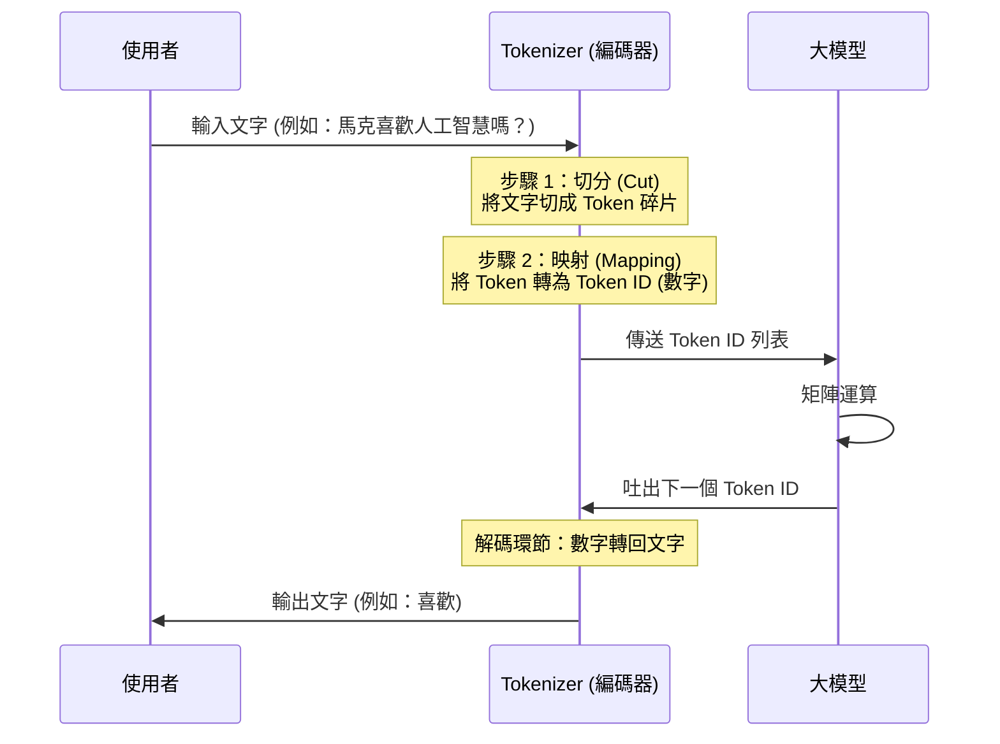

# 🥚大模型的最小單位：Token

> 大模型本質上是一個巨大的數學函數，內部進行矩陣運算，它輸出的與輸入的都是數字，並不理解人類文字 。因此，在人類與大模型之間需要一個翻譯官——**Tokenizer** 。

## 1. 核心運作原理

> Tokenizer 負責兩個環節：**編碼 (Encoding)** 與 **解碼 (Decoding)** 。

* **編碼 (Encoding)：**
* **第一步：切分 (Cut)** —— 將使用者的問題切成最小單位，這些碎片稱為 **Token** 。
* **第二步：映射 (Mapping)** —— 將每個 Token 映射為對應的數字，稱為 **Token ID** 。
* **解碼 (Decoding)：** 只有「映射」一個步驟，將模型輸出的數字轉回文字 。

### 【編碼流程時序圖】

## B. BPE 演演算法：如何訓練 Tokenizer？

> Tokenizer 不是靠複雜數學公式算出來的，而是透過演算法（如 **BPE, Byte Pair Encoding**）從大量文本中訓練出來的 。

* **核心邏輯：** 統計哪些字或詞經常出現在一起，將其合併為一個 Token 。
* **優點：** Tokenizer 就像一台**壓縮機**，能減少模型的輸入長度，進而提高推理速度與效率 。
* **換算比例：** 1 個 Token 大約代表 1.5 到 2 個漢字，或 0.75 個英文單詞 。
