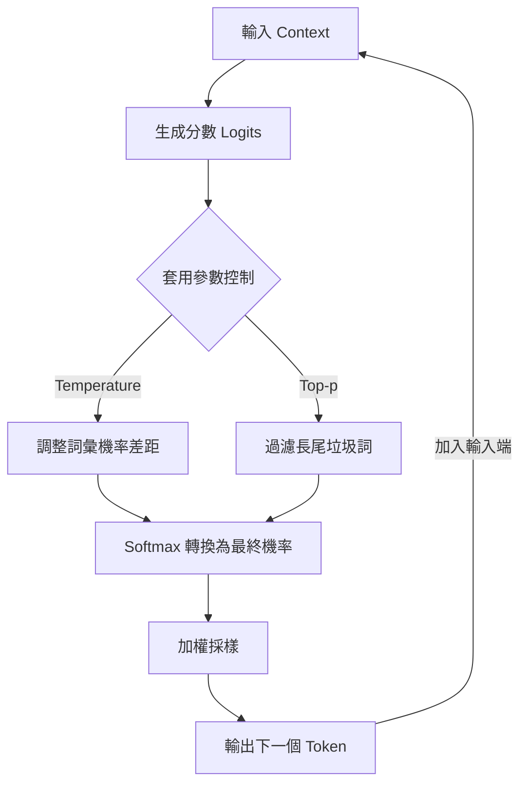

# 🌡️ Temperature/Top-p

> 大模型的任務是「預測下一個最可能出現的詞」 。這個過程包含三個步驟：**生成分數 (Logits)** -> **轉換機率 (Softmax)** -> **加權採樣** 。

## 【預測下一個詞的邏輯流程圖】

## 1. Temperature (溫度)

控制詞與詞之間的「機率差距」 。

* **低溫 (如 0.1)：** 拉大高分詞與低分詞的差距。產生「贏家通吃」局面，回答趨於保守、穩定、精確（適合寫代碼、做數學）。
* **高溫 (如 2.0)：** 縮小詞之間的差距，讓所有詞的機率趨於均等。回答變得隨機、多樣、熱情奔放（適合寫小說、腦力激盪）。

## 2. Top-p (核取樣)

> 全稱為「最高累加機率」，像是一個動態保全，負責切斷尾部的垃圾詞 。

* **運作邏輯：** 從第一名開始往下數，累加機率直到達到預設值 P（例如 0.9），之後的長尾詞一律丟棄 。
* **作用：** 防止模型在隨機抽樣時抽到完全不可靠、跑題的詞彙 。

## 【參數效果對比表】

| 參數 | 調低 (Low Value) | 調高 (High Value) | 適用場景 |
| --- | --- | --- | --- |
| **Temperature** | 穩定、邏輯嚴謹 | 隨機、創意豐富 | 低：解題 / 高：創作 |
| **Top-p** | 保守、專注核心 | 開放、容納異見 | 低：準確性 / 高：發散性 |
